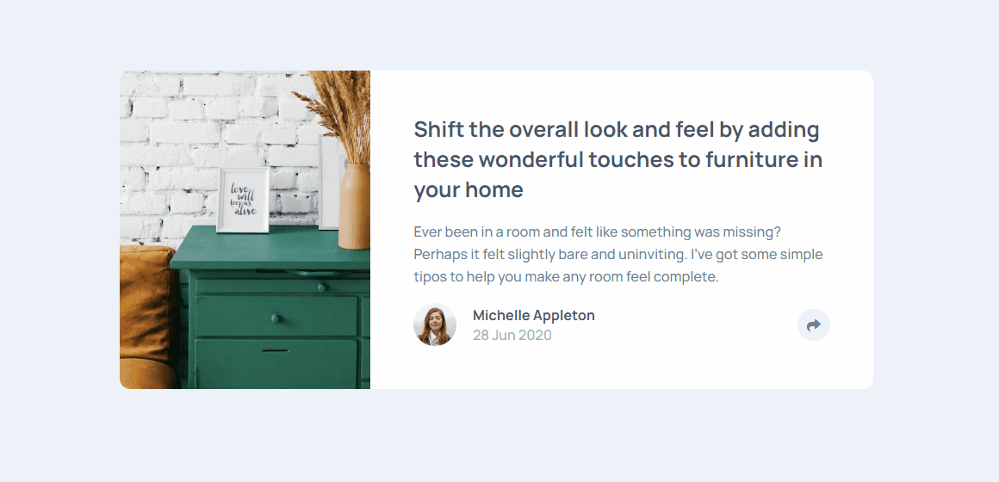
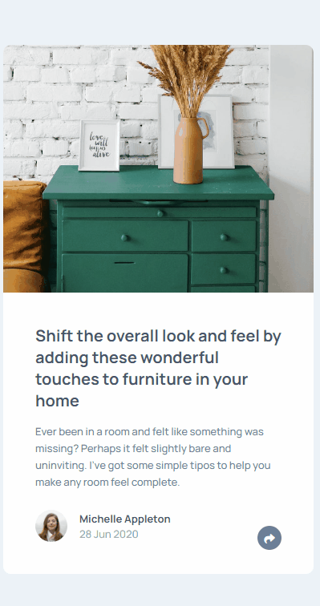

<h1 align = 'center'> Aticle Preview Component </h1>

 

 

 

## About the Project

This is a FrontendMentor Project that consists in a article component. It has some interactions that I made using JavaScript with some animations.
The project is also responsive for the most of the devices.

 

<h3 align = 'center'><a href = 'https://jhowbrcg.github.io/article-preview-component/'>See the project</a></h3>

 

## Technologies

- HTML
- SASS
- JavaScript
- Git

 

## Creator

| Author                                                                                                                                      |
| ------------------------------------------------------------------------------------------------------------------------------------------- |
| <a target="_blank" href="https://github.com/JhowBRCG"> </a> |
| &nbsp; &nbsp; &nbsp; Jhonathan                                                                                                              |
